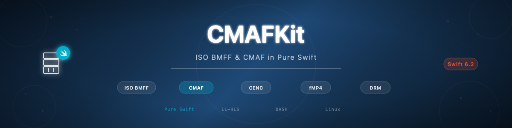

# swift-cmaf-kit

[](https://github.com/atelier-socle/swift-cmaf-kit/actions/workflows/ci.yml)
[](https://github.com/atelier-socle/swift-cmaf-kit/actions/workflows/platform-builds.yml)
[](https://github.com/atelier-socle/swift-cmaf-kit/actions/workflows/coverage-report.yml)
[](https://codecov.io/gh/atelier-socle/swift-cmaf-kit)
[](https://atelier-socle.github.io/swift-cmaf-kit/)
[](https://swift.org)
[]()
[](LICENSE)



A pure-Swift implementation of the Common Media Application Format (ISO/IEC 23000-19) plus the underlying ISO Base Media File Format hierarchy. Read, write, validate, and surface typed metadata for fragmented MP4 / CMAF media. Cross-platform from day one. Zero C vendoring. Swift 6.2 strict concurrency. 3,575 tests across macOS and Linux. The container and codec foundation of the [Atelier Socle](https://www.atelier-socle.com) streaming ecosystem.

## Status

**0.1.2** — refinement patch over the v0.1.1 surface. CLI refactored to the idiomatic library + thin executable pattern (unblocks `xcodebuild test` on Apple platforms); `swift-crypto` declared-but-unwired dependency removed; industry-grade uniform DocC coverage achieved with 94 new test-traceable code samples (113 swift blocks across 25 articles). Purely additive on the public typed surface — zero breaking change. APIs may evolve before 1.0 based on community feedback. The library ships two products (`CMAFKit` + opt-in `CMAFKitDRM`) and a companion executable (`cmafkit-cli`).

## What's new in 0.1.2

A refinement patch that closes the architectural cohesion gap with
the peer ecosystem (`swift-hls-kit`, `swift-srt-kit`, `swift-rtmp-kit`,
`swift-icecast-kit`) and brings the DocC catalog to industry-grade
uniform coverage. Every new code sample traces to an existing test.

| Refinement | What changed | Why |
|---|---|---|
| CLI architecture | New `CMAFKitCommands` library target + thin `CMAFKitCLI` executable wrapper | Mirrors peer-lib pattern; unblocks `xcodebuild test -scheme swift-cmaf-kit-Package -destination 'platform=macOS'` on Apple platforms |
| DocC enrichment | +94 swift code samples across 22 articles (14 → 113 blocks ecosystem-wide) | Industry-grade uniform coverage; every sample traces to a specific `@Test` (zero invention) |
| Dependency cleanup | `swift-crypto` removed (declared but unwired) | Phase A audit verified zero `import Crypto` call sites; 3 SPM dependencies → 2 |
| Catalog migration | `CMAFKitCLI.docc/` → `CMAFKitCommands.docc/` | The testable library owns the catalog (peer-lib convention) |
| ProtoBuf docs | `ProtocolBufferReader` / `ProtocolBufferWriter` doc comments expanded | Legitimises public visibility for consumers implementing custom DRM providers |

### Metrics

- **+94 swift code samples** across 22 documentation articles
- **Zero public symbol removed** since v0.1.1
- **Zero forbidden patterns** introduced
- **3 SPM dependencies → 2** (`swift-crypto` removed; `swift-argument-parser` + `swift-docc-plugin` remaining)
- **Coverage** ≥ 92 % global maintained (93.53 %)

### Validation

- `xcodebuild test -scheme swift-cmaf-kit-Package -destination 'platform=macOS'` → `TEST SUCCEEDED` (the headline behavioural validation of 0.1.2)
- `xcodebuild build` matrix 5 Apple platforms → `BUILD SUCCEEDED × 5`
- Linux Docker (`swift:6.2-jammy`, Swift 6.2.4) → `Test run with 3 574 tests passed`
- DocC × 3 (CMAFKit + CMAFKitDRM + CMAFKitCommands) → zero warnings

See [CHANGELOG.md](CHANGELOG.md) `[0.1.2]` for the complete shipped surface.

## Requirements

- Swift **6.2** toolchain (strict concurrency)
- macOS **14** / iOS **17** / iPadOS **17** / tvOS **17** / watchOS **10** / visionOS **1** / Linux (Swift 6.2)
- Xcode 26 (when building via xcodebuild)
- Zero external dependencies in `CMAFKit` / `CMAFKitDRM`. The CLI depends only on Apple's [`swift-argument-parser`](https://github.com/apple/swift-argument-parser).

## Installation

Swift Package Manager:

```swift
// Package.swift
dependencies: [
    .package(url: "https://github.com/atelier-socle/swift-cmaf-kit.git", from: "0.1.0"),
],
targets: [
    .target(
        name: "MyApp",
        dependencies: [
            .product(name: "CMAFKit", package: "swift-cmaf-kit"),
            // optional — typed DRM init-data decoding
            .product(name: "CMAFKitDRM", package: "swift-cmaf-kit"),
        ]
    )
]
```

## Quick start

```swift
import CMAFKit
import Foundation

let avc = AVCDecoderConfigurationRecord(
    profileIndication: .baseline,
    profileCompatibility: AVCProfileCompatibility(rawValue: 0xE0),
    levelIndication: .level3,
    lengthSize: .fourBytes,
    sequenceParameterSets: [AVCParameterSet(rbspBytes: Data([0x67, 0x42, 0xC0, 0x1E]))],
    pictureParameterSets: [AVCParameterSet(rbspBytes: Data([0x68, 0xCE, 0x3C, 0x80]))]
)

let video = CMAFTrackConfiguration(
    trackID: 1, kind: .video, profile: .basic, timescale: 90_000,
    language: "und",
    videoFields: CMAFTrackConfiguration.VideoFields(
        width: 1920, height: 1080,
        codec: .avc1, codecConfiguration: .avc(avc),
        frameRate: .init(numerator: 30, denominator: 1)
    )
)

// Write
let initBytes = try CMAFInitSegmentWriter(configurations: [video]).emit()

// Read back
let reader = try await CMAFInitSegmentReader(bytes: initBytes)
print(reader.tracks().count, "track(s)")
```

## Features

### Reading

- **ISOBMFF parsing** — every box from ISO/IEC 14496-12 needed for streaming, with typed surfaces and byte-perfect unknown-box round-trip preservation
- **Init segments** — `CMAFInitSegmentReader` (stateless value type) reconstructs the typed `CMAFTrackConfiguration` list from a `ftyp` + `moov` byte stream; handler-dispatched video / audio / subtitle / metadata resolution per ISO/IEC 14496-12 §8
- **Media segments** — `CMAFMediaSegmentReader` (actor) ingests segment-by-segment, yields typed `CMAFParsedSample` values with per-sample bytes, duration, composition-time offset, sync flag, decode time, and (when encrypted) IV + subsample partitions
- **Track analysis** — codec, profile, encryption scheme, language, video dimensions, audio sample rate / channel count, HDR / Dolby Vision metadata, closed-caption channels, edit list
- **Box registry** — pluggable `BoxRegistry` for custom box parsers; default registry covers 100+ ISOBMFF / CMAF boxes

### Writing

- **Init segments** — `CMAFInitSegmentWriter` composes the `ftyp` + `moov` tree from typed track configurations; brand composition selects `iso6` + the CMAF major brand (`cmfc` / `cmf2` / `cmff` / `cmfl` / `cmfs` / `cmfd` / `cmfh`) + codec-specific compatible brands
- **Media segments** — `CMAFMediaSegmentWriter` (actor) emits `moof` + `mdat` fragments with monotonic `tfdt` and sample-accurate `trun` offsets; supports multi-fragment segments and LL-HLS partial chunks via `CMAFPartialChunkBoundary`
- **Fragment boundaries** — `CMAFFragmentBoundary` predicates: `sampleCount(N)` / `durationSeconds(N)` / `onSyncSample` / `custom(predicate)`; SAP rule enforced at runtime (every video fragment opens on a sync sample)
- **Sample entries** — automatic dispatch to the right sample-entry composer per codec (10 video, 8 audio, 3 subtitle, 4 metadata codecs)
- **Encrypted output** — `encv` / `enca` sample-entry rewrite, `sinf` / `schm` / `schi` / `tenc` emission, `senc` boxes with per-sample IVs + optional subsample partitions
- **Segment indices** — `sidx` / `prft` / `emsg` emission for DASH-aligned content; LL-HLS partial chunks per IETF RFC 8216bis-15 §B

### Validating

- **CMAF** — `CMAFConformanceValidator` enforces 10+ rules from ISO/IEC 23000-19 §7 (SAP at fragment head, uniform track ID per traf, declared tracks, encryption symmetry, `iso6` + `cmfc` brand presence, `mfhd` sequence monotonicity, per-track `tfdt` monotonicity)
- **DASH** — `DASHConformanceValidator` enforces the ISO BMFF profile (ISO/IEC 23009-1 §6.3) and DASH-IF IOP recommendations (`sidx` mandatory, `prft` NTP signalling, `emsg` timescale alignment, segment-duration consistency, timescale ≥ 1000)
- **Low-Latency HLS** — `LLHLSConformanceValidator` enforces IETF RFC 8216bis-15 §B partial-chunk rules (first sample sync ↔ INDEPENDENT, unique `mfhd.sequence_number`, PART-TARGET enforcement, first-chunk INDEPENDENT flag, per-fragment `tfdt` monotonicity)
- **Structural integrity** — every typed parser throws a precise `ISOBoxError` / `CMAFReaderError` on malformed input, never silently degrades
- **Reports** — `CMAFValidationReport` aggregates issues across validators; each issue carries severity (error / warning / info), rule reference (spec section number), description, optional track ID, optional segment index

### Encrypting (Common Encryption)

- **All four schemes** per ISO/IEC 23001-7 — `cenc` (AES-CTR full-sample), `cbc1` (AES-CBC full-sample), `cens` (AES-CTR pattern), `cbcs` (AES-CBC pattern; the HLS FairPlay mode)
- **Pattern encryption** — `crypt_byte_block` / `skip_byte_block` parameters for `cens` and `cbcs`
- **Per-sample metadata** — typed `CMAFSampleInput.EncryptionMetadata` carries the IV + optional subsample partitions; the reader recovers them byte-perfectly
- **PSSH passthrough** — `ProtectionSystemSpecificHeaderBox` carries any DRM system's init data verbatim; the opt-in `CMAFKitDRM` target lifts it to typed shapes
- **No key material in the library** — CMAFKit packages and parses encrypted content; key acquisition and decryption live in the operator's downstream pipeline

### DRM init-data typing (opt-in `CMAFKitDRM`)

Typed `pssh.data` decoders for **9 publicly-registered DRM systems**:

| System | Wire format | Status |
|---|---|---|
| Widevine | `WidevineCencHeader` Protocol Buffer (10 fields) | full typing |
| PlayReady | PRO + WRMHEADER XML v4.0 / 4.1 / 4.2 / 4.3 | full typing |
| FairPlay Streaming | Apple Modular DRM binary | full typing |
| ClearKey | W3C EME §9 JSON + RFC 4648 §5 base64url | full typing |
| Marlin | Marlin Broadband BBA URN + inner payload | full typing |
| ChinaDRM | KID array per GY/T 277.2 + operator inner | full typing |
| Nagra Connect | proprietary, NDA-only | opaque wrapper (closed-spec) |
| Verimatrix Multi-DRM | proprietary | opaque wrapper (closed-spec) |
| Adobe Primetime | discontinued 2020 | opaque wrapper (deprecated service) |

Round-trip is byte-perfect for the six fully-typed providers (canonical-order encoding for Widevine + PlayReady; deterministic JSON for ClearKey) and for the three opaque wrappers (bytes preserved verbatim). Honest treatment of closed-spec providers is documented in each provider's file header — no fake-typing.

### Closed captions

- **In-band SEI extraction** — CEA-608 byte pairs and CEA-708 DTVCC packets carried inside AVC / HEVC SEI `user_data_registered_itu_t_t35` messages with the ATSC A/72 signature; `ClosedCaptionExtractor` actor surfaces typed `ClosedCaptionData`
- **DTVCC reassembly** — cross-NAL DTVCC packet reassembly per CTA-708-E §6 + SCTE-128 §8
- **Out-of-band caption tracks** — typed `c608` and `c708` sample entries per ISO/IEC 14496-30 §11.2 / §11.3
- **67-case CCService enum** — CEA-608 channels `cc1..cc4` + CEA-708 services `service1..service63`, with extended 7-bit service number support

### HDR and Dolby Vision

- **HDR10** — SMPTE ST 2086 mastering display colour volume (`mdcv`) + CTA-861.3 content light level (`clli`)
- **HLG / HDR10+** — colour-information box variants per ISO/IEC 14496-12 §8.5.2.2 + ISO/IEC 23001-8
- **Dolby Vision** — Profile 5 / 7 / 8.x / 10 with `DolbyVisionConfigurationBox` (`dvcC` / `dvvC` / `dvwC` / `lhvC`) + Enhancement Layer config; HDR10-compatible base-layer signalling
- **ICC colour profiles** — full `prof` colour information box reader + writer with element-relative `mluc` offsets per ICC.1:2010 + ICC.1:2022 §10.13 (Adobe / ColorSync / Argyll CMS cross-encoder interop verified)

### Cross-platform

- **Apple platforms** — macOS 14, iOS 17, iPadOS 17, tvOS 17, watchOS 10, visionOS 1; xcodebuild matrix runs on every release
- **Linux** — Swift 6.2 toolchain (`swift:6.2-jammy`); 3,574 tests / 3,574 pass; zero conditional dependencies (no `swift-crypto`, no platform shims)
- **Strict concurrency** — every public type is `Sendable`; zero `@unchecked Sendable`, zero `nonisolated(unsafe)`, zero `@preconcurrency`, zero `Task.detached`

## Standards coverage

| Standard | Section / Scope |
|---|---|
| ISO/IEC 14496-12 (ISO BMFF) | full box hierarchy |
| ISO/IEC 14496-14 (MPEG-4 sample entry) | `mp4a` |
| ISO/IEC 14496-15 (NAL unit carriage) | `avcC` / `hvcC` |
| ISO/IEC 14496-30 (Timed Text) | `wvtt` / `stpp` / `c608` / `c708` |
| ISO/IEC 23000-19 (CMAF) | 7 profiles, conformance validator |
| ISO/IEC 23001-7 (CENC) | 4 schemes |
| ISO/IEC 23001-8 (CICP) | colour primaries / transfer / matrix |
| ISO/IEC 23008-2 (HEVC) | full bitstream parsing |
| ISO/IEC 23008-3 (MPEG-H 3D Audio) | `mhm1` / `mhm2` |
| ISO/IEC 23009-1 (DASH ISO BMFF) | `sidx` / `prft` / `emsg` |
| ITU-T H.264 / H.265 | NAL units, parameter sets, VUI, HRD, SEI |
| IETF RFC 8216bis-15 (LL-HLS) | partial chunks |
| IETF RFC 9639 (FLAC) | frame header + metadata blocks |
| AOMedia AV1 | sequence header, OBU framing |
| WebM VP8 / VP9 | codec config records |
| ETSI TS 102 366 (AC-3 / E-AC-3) | AC3SpecificBox |
| ETSI TS 103 190-2 (AC-4) | AC4SpecificBox |
| W3C WebVTT / TTML2 / IMSC1 | subtitle formats |
| CTA-608-E / CTA-708-E | closed captions |
| ATSC A/72 / SCTE-128 | SEI signalling |
| ICC.1:2010 / 2022 | colour profile elements |
| Google Widevine | CencHeader Protocol Buffer |
| Microsoft PlayReady | PRO + WRMHEADER v4.0-4.3 |
| Apple FairPlay Streaming | Modular DRM binary |
| W3C EME ClearKey | JSON init data |
| MDC Marlin Broadband | BBA URN |
| GY/T 277.2 ChinaDRM | KID array |
| IETF RFC 4648 §5 | base64url |
| DASH-IF IOP | DRM system ID registry |

## Architecture

See the [DocC catalog](Sources/CMAFKit/CMAFKit.docc/) for the full API documentation. The library is organised in eleven layered modules where lower layers cannot reference upper layers (BinaryIO → Media → ISOBMFF → CodecBitstream → CodecSampleEntries → Color → Encryption → Fragmentation → Reader → Validator → CMAFProfiles).

A high-level overview is in [Showcase.md](Showcase.md).

## Atelier Socle ecosystem

| Library | Role |
|---|---|
| **swift-cmaf-kit** (this repo) | ISO BMFF / CMAF / CENC foundation |
| swift-hls-kit | HLS playlists + segments — depends on CMAFKit |
| swift-dash-kit (future) | DASH manifests + segments |
| swift-rtmp-kit | RTMP transport over TCP |
| swift-srt-kit | SRT transport over UDP |
| swift-icecast-kit | Icecast / Shoutcast HTTP audio |
| swift-capture-kit | Audio + video capture |

## CMAFKit vs CMAFKitDRM

`CMAFKit` ships the container, codec, conformance, and encryption surface. `CMAFKitDRM` is an opt-in second library product that lifts the opaque `pssh.data` field carried by ISOBMFF `pssh` boxes into typed shapes per the public specifications of nine DRM systems. Consumers that do not need DRM typing depend on `CMAFKit` only.

## CLI

`cmafkit-cli` is the companion executable:

```bash
cmafkit-cli probe init.mp4                          # per-track metadata
cmafkit-cli validate init.mp4 --profile cmaf        # conformance validator
cmafkit-cli dump-tree init.mp4 --depth 3            # box hierarchy
cmafkit-cli decrypt-init init.mp4 --output json     # typed DRM init data
```

Every subcommand accepts `--output text|json|table` and is read-only (never modifies the input file). The `decrypt-init` subcommand parses pssh init data; it never handles decryption key material.

## Testing

```bash
swift test                                          # 3575+ tests
xcodebuild test -scheme swift-cmaf-kit-Package \
    -destination 'platform=macOS'                   # Apple platforms
docker run --rm -v "$(pwd):/repo" -w /repo \
    swift:6.2-jammy bash -c "swift test"            # Linux parity
```

The 6-platform xcodebuild matrix (macOS / iOS Sim / iPadOS Sim / tvOS Sim / watchOS Sim / visionOS Sim) is run for every release.

## Contributing

Contributions welcome. Pull requests must:

- Pass `swift test` on macOS + Linux
- Pass `swift-format lint --strict` and `swiftlint --strict`
- Cite the relevant standard in the doc comment for any new public symbol
- Add tests for any new behaviour

## License

Apache 2.0 — see [LICENSE](LICENSE).

## Acknowledgments

CMAFKit is developed by Atelier Socle SAS. The library is built against the public specifications cited in the standards coverage table above; we acknowledge the standards organisations (ISO/IEC, ITU-T, IETF, ETSI, W3C, CTA, SCTE, DASH-IF, AOMedia) whose specifications make interoperable streaming media possible.
